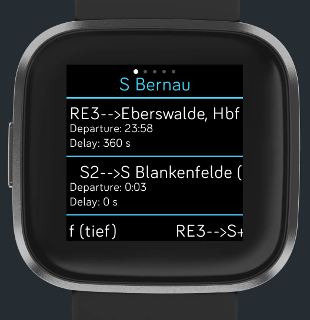
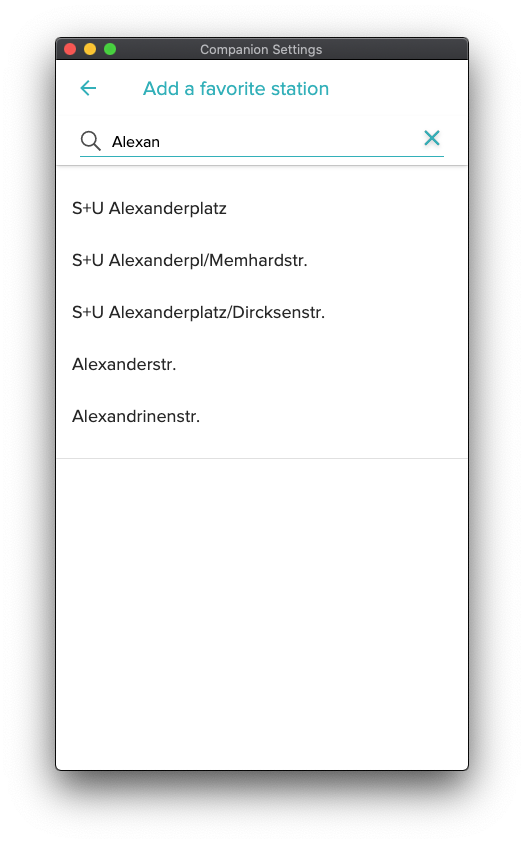
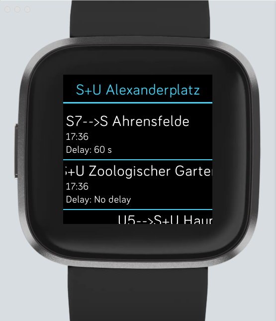

# BerlinBrandenburgTransport
## Kurzbeschreibung
Diese [Fitbit](https://www.fitbit.com)-App soll einmal die Abfahrtzeiten bestimmter Haltestellen oder der Haltestellen in der Nähe anzeigen.
Dafür wird auf die API des [VBB](https://www.vbb.de) zurückgegriffen.
Diese App ist in erster Linie eine Übungs-App und befindet sich aktuell in einem sehr frühen Entwicklungsstatium.
Die App basiert auf der Beispiel-App aus dem SDK: https://github.com/Fitbit/sdk-bart
**Die App wird mangels Fitbit nicht mehr weiterentwickelt.**

## Geplante Funktionen
- [x] Abfahrtzeiten einer Haltestelle anzeigen
- [x] eine Haltestelle als Favorit festlegen
- [ ] weitere Informationen zu einer Abfahrt anzeigen
- [ ] mehrere Haltestellen als Favoriten festlegen
- [ ] Haltestellen in der Nähe anzeigen
- [ ] wichtige Einstellungen auf der Uhr (Verkehrsmittel, Zeitraum der Abfrage, Anzahl der Ergebnisse etc.)

## Unterstützte Modelle
- Versa
- Versa 2
- Ionic
- Versa lite
- (Versa 3 in Planung)
- (Sense in Planung)

## Aktueller Stand
### v0.1.2
- verschiedene technisches Umstellungen (virtuelle Tile-Liste, Panorama-View) für weitere Features

#### Screenshot der aktuellen Version (v0.1.2)

### v0.1.1
- korrekte Anzeige der Suchvorschläge in den Einstellungen

### v0.1.0
- eine Haltestelle kann als Favorit festgelegt werden
- die sechs nächsten Abfahrtzeiten in den nächsten 10 Minuten werden angezeigt

#### Screenshot der aktuellen Version (v0.1.0)

